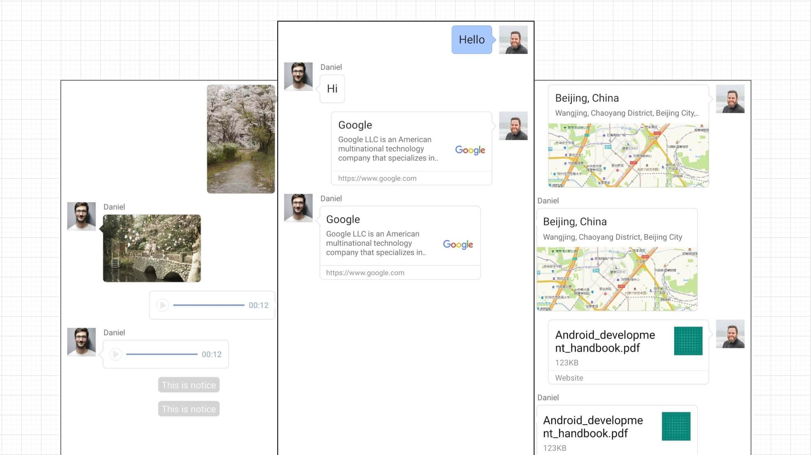

# MessageKit for Android

__README in English is coming soon.__

## 关于

#### 简介

__MessageKit__ 是用于聊天界面的开源库。通过源码，展示如何合理设计并开发一个美观、实用的消息界面。如有错误或异常修复，欢迎提交修改。




#### 特性：

- 开源库已包含多种常用消息类型的布局，详情请参考下文；
- 根据图片尺寸默认缩略图视图大小，具体参数可根据实际自行修改；
- 消息气泡样式用代码直接绘制，没有使用 __9-Patch__ 图片，最终安装包体积更小；
- 实现的消息布局和左右位置关系分离。消息布局编写一次，即适配发送者和接收者；
- 已定义抽象消息模型 __IMessage__，数据模型和业务解耦；
- 长按消息的交互蒙层位于消息前景(foreground)，而非消息背景(background)，因此视觉效果更佳；
- 头像、图片的加载框架与源码解耦，可自行选择框架实现图片加载；
- 列表已支持多选模式，但需要进一步实现多选后的操作和逻辑；
- 除了使用 __LayoutInflator__，源码更包含Anko实现的(实验性)布局，能避免xml布局反射导致主线程阻塞；
- 多种设计模式的应用降低后期工程的维护难度，如：__模板模式__ ；

#### 注意事项：

- 聊天消息界面需求变化多端，本工程不具备一般仓库开箱即用的能力。强烈建议开发者把源码集成到目标工程，本源码也不提供Maven依赖；
- 因不提供线上版本依赖，__错误__ 和 __缺陷修复__ 请关注更新列表和最新源码；

- 源码集成后还需要各位根据需求继续开发，开发预估时间更长，在 __商业项目__ 中谨慎使用；
- 若有自定义功能或其他样式，请基于已有代码继续实现。本仓库暂不接受带定制化性质的 Pull Request；
- 如果有任何疑问请提issue，作者会尽量回答问题并选择性添加到Readme供参阅；

#### 支持类型:

__Max Scrap__ for screen resolution: 1920*1080

|   Type   |     Message Name      |     Layout Type     | Max Scrap |
| :------: | :-------------------: | :-----------------: | :-------: |
|   Text   |   MESSAGE_TYPE_TEXT   |   layout_msg_text   |     15    |
|   Url    |   MESSAGE_TYPE_URL    |   layout_msg_url    |     10    |
|  Notice  |  MESSAGE_TYPE_NOTICE  |  layout_msg_notice  |     8     |
| Location | MESSAGE_TYPE_LOCATION | layout_msg_location |     8     |
|  Image   |  MESSAGE_TYPE_IMAGE   |  layout_msg_media   |     8     |
|  Video   |  MESSAGE_TYPE_VIDEO   |  layout_msg_media   |     8     |
|  Audio   |  MESSAGE_TYPE_AUDIO   |   layout_msg_audio  |     14    |
|   File   |   MESSAGE_TYPE_FILE   |   layout_msg_file   |     11    |

## 使用方式

迁移 __基础源码__ 到您的工程。源码包含 __布局资源__、__字符串资源__、__库定义类__ 和 __gradle依赖__，具体消息(示例)实现类选择性迁移。

#### 数据模型：

以下是供参考的数据模型实现，请实现接口 __IMessage__ 为视图提供数据支持。

```java
public abstract class Message implements IMessage {
    /**
     * Message type, required.
     */
    private String type;

    /**
     * Message id, required.
     */
    private String messageId;

    /**
     * Message body, required.
     */
    private String body;

    /**
     * Message sender, required;
     */
    private String sender;

    /**
     * Message comes from roomId, required.
     */
    private String roomId;

    /**
     * Message timestamp, required.
     */
    private long timestamp;

    public Message(@NonNull String type, @NonNull String body) {
        this.type = type;
        this.body = body;
    }

    public Message(String type, String messageId,
                   String body, String sender,
                   String roomId, long timestamp) {
        this.type = type;
        this.messageId = messageId;
        this.body = body;
        this.sender = sender;
        this.roomId = roomId;
        this.timestamp = timestamp;
    }
    
    ......
}
```

#### 视图绑定：

实现 __ViewHolder__，父类可选 __BaseViewHolder__ 或 __AbstractViewHolder__。

__BaseViewHolder__ 继承 __AbstractViewHolder__，已处理头像加载、名称设置、消息前景背景、监听器绑定操作，使用方法请参考 __LocationViewHolder__。

```kotlin
class LocationViewHolder(itemView: View) : BaseViewHolder(itemView) {
    /**
     * The name of the location, required.
     */
    private val mName: TextView = itemView.findViewById(R.id.name)

    /**
     * The address of the location, required.
     */
    private val mAddress: TextView = itemView.findViewById(R.id.address)

    /**
     * The map image of the location, optional.
     */
    private val mImage: ImageView = itemView.findViewById(R.id.image)

    override fun onBind(activity: Activity, message: IMessage) {
        super.onBind(activity, message)
        val msg = message as LocationMessage
        mName.text = msg.name
        mAddress.text = msg.address
        mResLoader.loadImage(activity, message.image ?: "", mImage)
    }
}
```

如果需要更简单的逻辑，可使用 __AbstractViewHolder__ 抽象父类，请参考 __NoticeViewHolder__。

```kotlin
class NoticeViewHolder(itemView: View) : AbstractViewHolder(itemView) {
    /**
     * Notice text.
     */
    private val mText: TextView = itemView.notice

    /**
     * Override as an empty implementation.
     */
    override fun onHolderCreated() {
    }

    override fun onBind(activity: Activity, message: IMessage) {
        mText.text = message.getBody()
    }
}
```

设置完成后的视图在 __MessageHolders__ 内注册：

```kotlin
class MessageHolders(private val mInflater: LayoutInflater,
                     private val mItemListener: IMessageItemListener,
                     private val mResLoader: IMessageResLoader) {

   ......

    // Register you ViewHolder here like this:
    companion object {
        private const val HOLDER_TEXT = 2

        /**
         * Get view type id by message's type string.
         */
        private val sViewType = HashMap<String, Int>().apply {
            put(Message.MESSAGE_TYPE_TEXT, HOLDER_TEXT)
        }

        /**
         * Content types array.
         *
         * Use SparseArray<HolderConfig>() instead of HashMap<int, HolderConfig>() to save memory.
         */
        private val sContentTypes by lazy(LazyThreadSafetyMode.NONE) {
            val textConfig = HolderConfig(R.layout.vkit_layout_msg_text, ::TextViewHolder, 15)

            return@lazy SparseArray<HolderConfig>().apply {
                put(HOLDER_DEFAULT, textConfig)
            }
        }
      
        ......
    }
}
```

#### 列表组件：

使用系统组件即可。如果您使用了自定义 __RecyclerView__ ，请适当处理出现的冲突和异常。

```xml
<androidx.recyclerview.widget.RecyclerView
    android:id="@+id/messageView"
    android:layout_width="match_parent"
    android:layout_height="match_parent"
    android:background="@android:color/white"
    android:overScrollMode="never"
    android:scrollbars="vertical"
    tools:listitem="@layout/vkit_layout_msg_text"/>
```

#### Adapter

继承并实现抽象父类 __AbstractMessageAdapter<RecyclerView.ViewHolder>__ 的抽象方法。

```kotlin
open class MessageAdapter(private val mActivity: Activity,
                          private val mItemListener: IMessageItemListener,
                          resLoader: IMessageResLoader) :AbstractMessageAdapter<RecyclerView.ViewHolder>() {
    
    // Some abstract methods must to implement here.
    ....
}
```

#### 初始化

初始化 __AbstractMessageAdapter__ 实现类并设置到 __RecyclerView__：

- __MessageItemListener__ 是 __IMessageItemListener__ 的实现类，负责处理消息点击、长按等操作；

- __MessageResLoader__ 是 __IMessageResLoader__ 的实现类，图片加载类与逻辑分离，负责加载头像、聊天图片。

```kotlin
class MessagesActivity : AppCompatActivity() {
    private lateinit var mAdapter: MessageAdapter

    /**
     * LinearLayoutManager for MessageAdapter.
     */
    private val mLayoutManager = LinearLayoutManager(this, RecyclerView.VERTICAL, false)

    override fun onCreate(savedInstanceState: Bundle?) {
        super.onCreate(savedInstanceState)
        setContentView(R.layout.activity_message)

        // MessageResLoader is a Kotlin singleton.
        mAdapter = MessageAdapter(this, MessageItemListener(), MessageResLoader)
        mAdapter.setHasStableIds(true)

        mLayoutManager.isSmoothScrollbarEnabled = true
        messageView.layoutManager = mLayoutManager
        messageView.adapter = mAdapter
        messageView.setHasFixedSize(true)
        MessageHolders.setMaxScrap(messageView)
    }
}
```

#### 刷新数据

完成以上步骤即可刷新数据，默认沿用 __RecyclerView.Adapter.notifyItemInserted__ 等增删改动画。

```kotlin
val msg = TextMessage("Hello")
msg.setSender("Austin")
msg.setTimestamp(1548518400) // millisecond.
mAdapter.add(msg)
mAdapter.notifyDataSetChanged()
```

## License

```
MIT License

Copyright (c) 2019 WenKang Tan

https://github.com/phantomVK/MessageKit/blob/master/LICENSE

Permission is hereby granted, free of charge, to any person obtaining a copy
of this software and associated documentation files (the "Software"), to deal
in the Software without restriction, including without limitation the rights
to use, copy, modify, merge, publish, distribute, sublicense, and/or sell
copies of the Software, and to permit persons to whom the Software is
furnished to do so, subject to the following conditions:

The above copyright notice and this permission notice shall be included in all
copies or substantial portions of the Software.

THE SOFTWARE IS PROVIDED "AS IS", WITHOUT WARRANTY OF ANY KIND, EXPRESS OR
IMPLIED, INCLUDING BUT NOT LIMITED TO THE WARRANTIES OF MERCHANTABILITY,
FITNESS FOR A PARTICULAR PURPOSE AND NONINFRINGEMENT. IN NO EVENT SHALL THE
AUTHORS OR COPYRIGHT HOLDERS BE LIABLE FOR ANY CLAIM, DAMAGES OR OTHER
LIABILITY, WHETHER IN AN ACTION OF CONTRACT, TORT OR OTHERWISE, ARISING FROM,
OUT OF OR IN CONNECTION WITH THE SOFTWARE OR THE USE OR OTHER DEALINGS IN THE
SOFTWARE.
```
